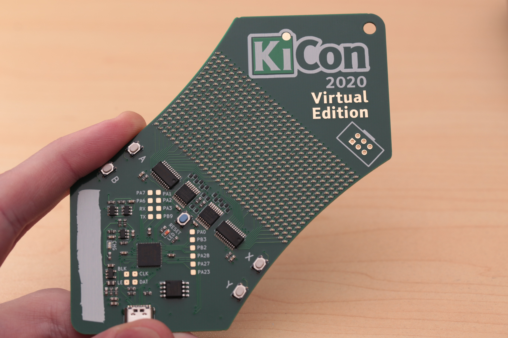
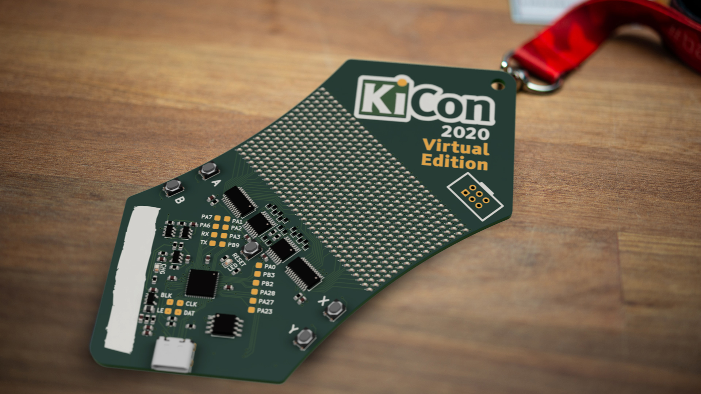

# KiCon 2020 Virtual Badge by Greg Davill

Based off the design+template by [Thomas Flummer](https://gitlab.com/flummer/kicon-2020-virtual-badge)

I was inspired by the design Thomas made, and wanted to try and extend the badge with more LEDs. I'm using a similar architecture to the LED panels on the d20 and small LED cube I built, except this only has 1 colour of LED in the Matrix.

## Firmware

I've not coded up firmware for a display like this with a microcontroller before, and I've had trouble with the SAMD21's DMA controller and cyclic descriptors in the past. The display will require constant attention from the SAMD as it is a multiplexed display, I'm hoping that implementing a framebuffer + Binary Coded Modulation will be possible.

## Assembly

The LED matrix is 32x16. Or 512 individual LEDs, these are all 0402 in size, so manual assembly may not be for the casual electronics enthusiast.
At any rate I'd recommend using a solderpaste stencil and reflow oven.

## Making your own

If you want to make your own, I have included the gerbers, in case you don't want to install the nightly version.
The board is 4 layers mostly to assist in routing of the matrix. The cost difference between 2L and 4L at JLC is only $5 on their barebones service.

## Please share

If you decide to make this badge or a variant of it, please share images so we can all see it and get inspired. If sharing on social media, please use the #badgelife tag and please let [me](https://twitter.com/gregdavill) and [thomas](https://thomasflummer.com/) know, I would love to see what you have made!
